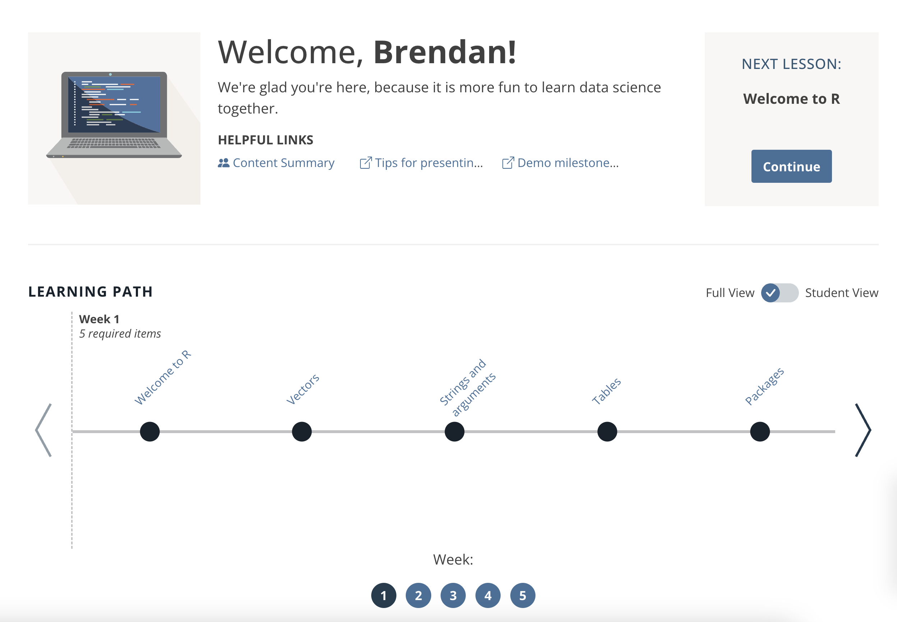

class:

```{r setup, include=FALSE}
options(htmltools.dir.version = FALSE)
knitr::opts_chunk$set(fig.retina = 3)
library(tidyverse)
```

```{r reactable-function, include=FALSE}
reactable_preview <- function(data) {
  
  page_info <- "{rowStart}-{rowEnd} of {rows} rows"
  
  if (nrow(data) > 100) {
    page_info <- glue::glue(
      "{page_info} (Total: {actual})", 
      actual = format(nrow(data), big.mark = ",")
    )
  }
  
  data %>% 
    slice_head(n = 100) %>% 
    reactable::reactable(
      defaultColDef = reactable::colDef(align = "left", maxWidth = 400),
      defaultPageSize = 8, 
      compact = TRUE,
      wrap = FALSE,
      striped = TRUE,
      sortable = FALSE, 
      showPageInfo = TRUE,
      language = reactable::reactableLang(
        pageInfo = page_info
      )
    )
}
```

```{r xaringan-stuff, include=FALSE}
xaringanExtra::use_xaringan_extra(c("tile_view", "panelset", "share_again"))
xaringanExtra::use_clipboard(selector = "pre > code.r, pre > code.md")
xaringanExtra::use_tachyons()

if (!is.null(rmarkdown::metadata$shortlink)) {
  shortlink <- rmarkdown::metadata$shortlink
  if (is.character(shortlink)) {
    shortlink <- list(url = shortlink)
  }
  stopifnot(!is.null(shortlink$url))
  
  if (is.null(shortlink$text) || !nzchar(shortlink$text)) {
    shortlink$text <- basename(shortlink$url)
  }
  
  xaringanExtra::use_banner(
    bottom_left = htmltools::tags$a(href = shortlink$url, shortlink$text),
    exclude = "title-slide"
  )
}
```


# .big-text[Welcome] 

## Introduction to Data Science with R

WiFi: **Posit Conf 2023**

Password: **conf2023**

<div class="title-footer">
  
  <div> `r rmarkdown::metadata$date`</div>
</div>

---
class: middle, agenda

# Session 1 Agenda

1. Logistics: Policies, Goals, and Schedules
1. Tech and tooling
1. Review: Group challenge

???


---
class: middle, chapter-slide blue

.big-white-number[1.]

# Policies, Goals, & Schedules 

---
class: inverse
# Code of conduct & Workshop policies

- The Code of Conduct and COVID policies can be found at https://posit.co/code-of-conduct/. Please review them carefully. 

<br>

- You can report Code of Conduct violations in person, by email, or by phone. Please see the policy linked above for contact information.

<br>

- Participants who do not wish to be photographed have .light-red[red lanyards]; please note everyone's lanyard colors before taking a photo and respect their choices.

---
class: inverse

# Locations to note


- There are gender-neutral bathrooms located among the Grand Suite Bathrooms

<br>

- There are two meditation/prayer rooms: Grand Suite 2A and Grand Suite 2B. Open Sunday - Tuesday 7:30 a.m. - 7:00 p.m., Wednesday 8:00 a.m. - 6:00 p.m.

<br>
  
- A lactation room is located in Grand Suite 1. Open Sunday - Tuesday 7:30 a.m. - 7:00 p.m., Wednesday 8:00 a.m. - 6:00 p.m.
   
  
---
class: middle, center, inverse

.pull-left[
# `r fontawesome::fa("fas fa-wifi")`
Wifi network name  

.light-red[`r params$wifi_network`]

]

.pull-right[
# `r fontawesome::fa("fas fa-key")`

Wifi password

.light-red[`r params$wifi_password`]

]

---
class: inverse, center, middle
background-image: url("https://images.unsplash.com/photo-1538370965046-79c0d6907d47?ixlib=rb-1.2.1&ixid=MnwxMjA3fDB8MHxwaG90by1wYWdlfHx8fGVufDB8fHx8&auto=format&fit=crop&w=2938&q=80")
background-size: cover

# .big-text.white[Welcome!]

???

So now, with those procedural things out of the way, let me officially welcome you to the conf component of the Introduction to Data Science with R and the Tidyverse! 

---
background-image: url("https://images.unsplash.com/photo-1457369804613-52c61a468e7d?ixlib=rb-1.2.1&ixid=MnwxMjA3fDB8MHxwaG90by1wYWdlfHx8fGVufDB8fHx8&auto=format&fit=crop&w=1770&q=80")
background-size: cover

???

You've heard us say this before...

At Posit Academy, we believe that learning any new skill (whether its musical, computational, athletic -- *really any new skill*) is not simply about memorizing new facts...

---
background-image: url("https://images.unsplash.com/photo-1614935151651-0bea6508db6b?ixlib=rb-1.2.1&ixid=MnwxMjA3fDB8MHxwaG90by1wYWdlfHx8fGVufDB8fHx8&auto=format&fit=crop&w=1850&q=80")
background-size: cover


???

but it's about applying them...
---
background-image: url("https://images.unsplash.com/photo-1584208124835-8a3d74ae211c?ixlib=rb-1.2.1&ixid=MnwxMjA3fDB8MHxwaG90by1wYWdlfHx8fGVufDB8fHx8&auto=format&fit=crop&w=1084&q=80")
background-size: cover


???

-- it's about a commitment to practice

---
background-image: url("https://images.unsplash.com/photo-1517245386807-bb43f82c33c4?ixlib=rb-1.2.1&ixid=MnwxMjA3fDB8MHxwaG90by1wYWdlfHx8fGVufDB8fHx8&auto=format&fit=crop&w=1770&q=80")
background-size: cover


???

-- a dedication to putting yourself out there and seeking out feedback

---

background-image: url("https://images.unsplash.com/photo-1562411052-105105232432?ixlib=rb-1.2.1&ixid=MnwxMjA3fDB8MHxwaG90by1wYWdlfHx8fGVufDB8fHx8&auto=format&fit=crop&w=1771&q=80")
background-size: cover

???
-- and the resolve to doing these things many times over...


---
background-image: url("https://images.unsplash.com/photo-1519389950473-47ba0277781c?ixlib=rb-1.2.1&ixid=MnwxMjA3fDB8MHxwaG90by1wYWdlfHx8fGVufDB8fHx8&auto=format&fit=crop&w=1770&q=80")
background-size: cover

???

By being here the next two days, you are checking off all of these boxes in some form. And you happen to be doing this for a skillset that is both highly valuable and versatile. 

You can take your coding and data science skills with you to any job 
-- and apply them to goals both professional and personal.

---
class: center, top
background-image: url(https://images.unsplash.com/photo-1520962880247-cfaf541c8724?ixlib=rb-1.2.1&ixid=MnwxMjA3fDB8MHxwaG90by1wYWdlfHx8fGVufDB8fHx8&auto=format&fit=crop&w=1332&q=80)
background-position: center
background-size: cover

# Goals

???

For the next two days, our goals are to support you in this by allowing for more group work, exposure to new projects and datasets, and more engagement with us. Specifically...[CLICK]

1. Practice with some familiar wrangling skills and explore new ones [CLICK]

1. Learn best practices for exploring your data and reporting it reproducibly

In short, we hope the next two days allow you to do a deep-dive into the skills you've been learning the past few weeks, to apply new skills you'll learn, and take advantage of a lot of protected time for practice. 

--

Practice with some familiar wrangling skills and explore new ones

--

Learn best practices for exploring your data and reporting it reproducibly

---
class: speaker-slide

# Hello (again)!
<!-- You can copy the image link address from your github profile to use as the src link below --> 

.pull-left[


.speaker-links[
`r fontawesome::fa("envelope")` brendan.cullen@posit.co
]
]

.pull-right[


.speaker-links[
`r fontawesome::fa("envelope")` kristin.bott@posit.co
]
]

???

And we will be guiding you as you do this...

---
class: middle, center
background-image: url("images/session01/scooters-dark.png")
background-size: cover

# .big-text.white[The Lineup]

???
Let's take a look at what we have lined up for you for the next couple days...

---
class: middle, center

.pull-left[

## Day One:

Review & Warm-up

Exploratory data analysis

Intro to Quarto

Build a Quarto report (Hotels project)
]

.pull-right[

## Day Two:

Best practices

Explore a new data set

Data types (strings, factors, dates)

Share project work & Wrap-up
]

---
class: center, top

# Daily schedule

.spaced[

| Time          | Activity                                                      |
|:--------------|:--------------------------------------------------------------|
| 09:00 - 10:30 | Session 1                                                     |
| 10:30 - 11:00 | *Break* `r emo::ji("coffee")`                                 |
| 11:00 - 12:30 | Session 2                                                     |
| 12:30 - 01:30 | *Lunch* `r emo::ji("bento")`                                  |  
| 01:30 - 03:00 | Session 3                                                     |
| 03:00 - 03:30 | *Break* `r emo::ji("tea")`                                    |
| 03:30 - 05:00 | Session 4                                                     |

]

---
class: middle, chapter-slide tan

.big-white-number[2.]

# Tech and tooling

---
class: inverse, middle, center

# Workspace

```{r echo=FALSE, out.width="60%"}

```

???

Demo conf campsite

---
class: inverse, middle, center

# Code + Announcements

  <br>
    
  ```{r slack, echo = FALSE, out.width = "40%"}
  knitr::include_graphics("images/session01/slack.png")
  ```

  <br>
  
  Your group's slack channel  
  
  `#academy-intro-r-a`
  
  `#academy-intro-r-b`

---
class: inverse, center, middle
# Stickies!

.pull-left[

## Done

```{r g, echo = FALSE, out.width = "40%"}
knitr::include_graphics("images/session01/green-square.png")
```
]

.pull-right[

## Help

```{r p, echo = FALSE, out.width = "40%"}
knitr::include_graphics("images/session01/pink-square.png")
```
]

???
Finally --  throughout the workshop, we'll use sticky notes to signal either being done with an activity or needing help. 

* You should place a green sticky on your laptop if you’re done with an exercise and a pink sticky if you want help. [CLICK]

* You can use pink stickies at anytime during the session to signal that you're stuck, lost, or would like help.

* We will be on the lookout for stickies throughout each session. 

---
class: middle, chapter-slide green

.big-white-number[3.]

# Review: Group challenge

???

Alright, our Review group challenge is up next

But before I explain that...

---
class: inverse, middle, center

.big-text.white[
# Questions?
]

???

Any questions about any of this so far?

