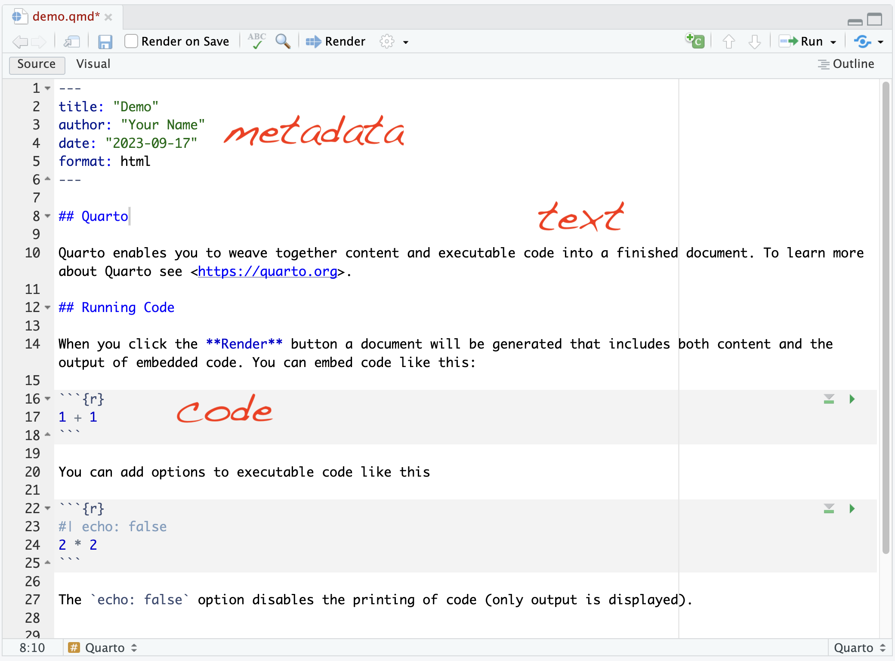
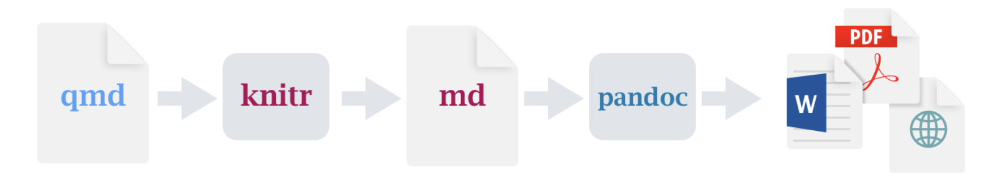
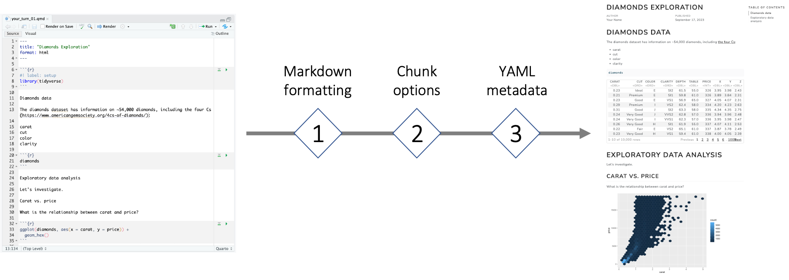
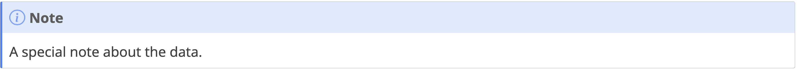
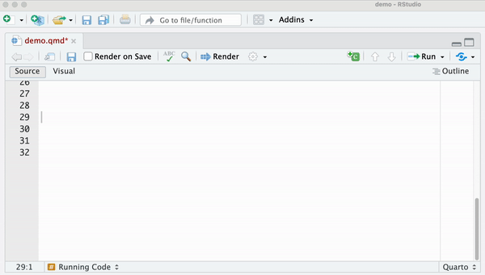
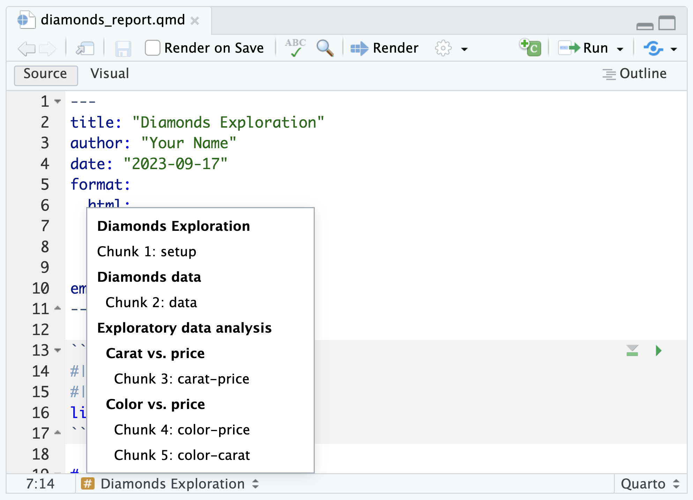

class: title-slide

```{r setup, include=FALSE}
options(htmltools.dir.version = FALSE)

# Load packages
library(countdown)
library(ymlthis)
library(tidyverse)
```

# `r rmarkdown::metadata$title`

### `r rmarkdown::metadata$subtitle`

<div class="title-footer">
  
  <div> `r rmarkdown::metadata$date`</div>
</div>


```{r xaringanExtra, echo=FALSE}
xaringanExtra::use_xaringan_extra(c("tile_view", "panelset", "share_again"))
xaringanExtra::use_clipboard(selector = "pre > code.r, pre > code.md")

if (!is.null(rmarkdown::metadata$shortlink)) {
  shortlink <- rmarkdown::metadata$shortlink
  if (is.character(shortlink)) {
    shortlink <- list(url = shortlink)
  }
  stopifnot(!is.null(shortlink$url))
  
  if (is.null(shortlink$text) || !nzchar(shortlink$text)) {
    shortlink$text <- basename(shortlink$url)
  }
  
  xaringanExtra::use_banner(
    bottom_left = htmltools::tags$a(href = shortlink$url, shortlink$text),
    exclude = "title-slide"
  )
}
```

---
class: middle

# Agenda

1. What is Quarto?
1. Why use Quarto?
1. The 3 essential ingredients
  - Text
  - Code
  - Metadata

---
class: middle chapter-slide red

.big-white-number[1.]

# What is Quarto?

---
# What is Quarto?

`r emo::ji("writing_hand")` An authoring framework for data science

--

`r emo::ji("floppy_disk")` A file format (`.qmd`)

--

`r fontawesome::fa("terminal")` A [command line interface](https://github.com/quarto-dev/quarto-cli)

--

`r emo::ji("package")` An [R package](https://quarto-dev.github.io/quarto-r/) (quarto)

--

`r emo::ji("hammer_and_wrench")` A tool for integrating prose, code, and output

--

`r emo::ji("sparkles")` Magic

---
# What's in a `.qmd`?

.pull-left[

`r emo::ji("page_with_curl")` Text and headers

`r emo::ji("computer")` Code (R, Python, and more)

`r emo::ji("bar_chart")` Output (e.g. plots, tables, model results)

`r emo::ji("framed_picture")` Images

... and more!
]

.pull-right[
```{r echo=FALSE, out.width="100%"}
knitr::include_graphics("images/session03-quarto/doc-make.jpg")
```
]
---
class: middle chapter-slide blue

.big-white-number[2.]

# Why use Quarto? 

---
background-image: url(images/session03-quarto/replication-crisis.png
background-position: center;
background-size: 80% 
# Replication crisis

???

* These are just a few headlines from the past or so that highlight an ongoing problem across many fields of science -- that many published studies fail to replicate.

* I won't go into details here, but suffice it to say, to solve the reproducibility crisis, 
we need both cultural changes in how science is conducted AND technological solutions. 

* Quarto gives us just that -- a technological solution for reproducibility.

---
background-image: url(images/session03-quarto/reproducibility.gif)
background-position: center;
background-size: 100% 

???

* To put this in perspective, I'm going to borrow one of my favorite historical analogies; 
we can think of Quarto like the advent of the printing press in the 15th century.

* The printing press made it possible to reproduce any book AND, more importantly, make that process AUTOMATABLE. This revolutionary technology allowed the dissemination of information to the masses,
which had a wide-ranging impact on society at large

* Quarto does something similar for data science today -- you can share your 
Quarto document with someone else, and that person will have everything they 
need to reproduce your analysis AUTOMATICALLY, with the click of a button.

* Because this process can be entirely automated, this has huge potential in a 
business setting to increase the efficiency of data science workflows, which in turn can lead
to better business outcomes

---
# Beautiful data products

```{r echo=FALSE, out.width="100%"}
knitr::include_url("https://quarto.org/docs/gallery/")
```

https://quarto.org/docs/gallery/

---
# Multilingual data science 

.center[
```{r echo=FALSE, out.width="70%"}
knitr::include_graphics("images/session03-quarto/quarto-languages.png")
```
]

Image source: ["Hello Quarto", rstudio::conf(2022)](https://posit.co/keynotes/hello-quarto-share-collaborate-teach-reimagine/)
---
class: middle chapter-slide green

.big-white-number[3.]

# The 3 essential ingredients

---
# The 3 essential ingredients

.pull-left[
## 1. Text

## 2. Code

## 3. Metadata
]

.pull-right[
```{r echo=FALSE, out.width="100%"}

```
]

---
# The 3 essential <span style="color:red">frameworks</span>

.pull-left[
## 1. Text &rarr; <span style="color:red">Markdown</span>

## 2. Code &rarr; <span style="color:red">knitr</span>

## 3. Metadata &rarr; <span style="color:red">YAML</span>
]

.pull-right[
```{r echo=FALSE, out.width="100%"}

```
]

???

How does this all come together? Rendering!

---
# Render

<br>

.center[
```{r echo=FALSE, out.width="100%"}

```
]


???
When you render the document... 

1. Quarto sends the .qmd file to knitr, runs all the code and embeds results and text into an .md file.

2. Pandoc then converts the .md file into your chosen output format, which you specify using YAML metadata.

---
# Render

<video width="1190" height="475" controls>
    <source src="images/session03-quarto/render_demo.mp4" type="video/mp4"> </video>

---
# Roadmap

<br>

.center[
```{r echo=FALSE, out.width="100%"}

```
]

---
class: inverse middle center

# Text
## Markdown

---

# Text


.pull-left[

What you type in `.qmd` `r emo::ji("point_down")` 

***

````markdown
Regular text


*italics*


**bold**  


`verbatim code` 


> Blockquote
````
]

.pull-right[

Rendered output `r emo::ji("point_down")` 

***

Regular text

*italics*

**bold**  

`verbatim code`

> Blockquote
]

???
I will go through this information quickly. Don't worry about absorbing all of this detail now. Have your cheatsheet handy for the exercises.

---

# Headers

.pull-left[
````markdown
# Header 1

## Header 2

### Header 3

#### Header 4

##### Header 5

###### Header 6
````
]

.pull-right[
# Header 1

## Header 2

### Header 3

#### Header 4

##### Header 5

###### Header 6
]

---
# Lists

.panelset[
.panel[.panel-name[Unordered]

.pull-left[

````markdown
* item 1
    + sub-item 1
    + sub-item 2
````

]

.pull-right[
* item 1
    + sub-item 1
    + sub-item 2
]
]

.panel[.panel-name[Ordered]

.pull-left[

```markdown
1. item 1
2. item 2
    i) sub-item 1
```

]

.pull-right[
1.  item 1
2.  item 2  
    i)  sub-item 1

]
]
]

---
# Images

```markdown

```

<figure>

</figure>

---
# Images


```markdown

```

```{css, echo=FALSE}
figure {
  font-size: 30px;
}
```

<figure>

<figcaption>Hex logo</figcaption>
</figure>

---
# Images

```markdown
{width=50%}
```

<figure>

<figcaption>Hex logo</figcaption>
</figure>

---

# Links

```markdown
Read more about Quarto [here](https://quarto.org/).
```

Read more about Quarto [here](https://quarto.org/).

---
# Callouts

```markdown
::: {.callout-note}
A special note about the data.
:::
```

```{r echo=FALSE, out.width="100%"}

```


`r emo::ji("information")` Five types of callouts, including:
`note`, `warning`, `important`, `tip`, and `caution`.

---
class: your-turn

# Your Turn 1 (with a partner!)

.panelset[
.panel[.panel-name[Overview]

1. `r emo::ji("file_folder")` Open `your_turn_01.qmd`.

1. `r emo::ji("mag")` Inspect the contents of <a href="https://rsacdn.link/milestones/conf/r-intro/conf-sessions/session03-quarto/data/your_turn_01_solution.html" rel="noopener noreferrer" target="_blank">this HTML output</a>.

1. `r emo::ji("computer")` Add **markdown formatting** to `your_turn_01.qmd` to re-create the HTML output.

1.  Render `your_turn_01.qmd` to check your work.

]

.panel[.panel-name[Steps]

1. Add Level-1 and Level-2 headers

1. Add a bulleted list

1. Add a [hyperlink](https://www.americangemsociety.org/4cs-of-diamonds/)

1. Add an image (saved in the `images/` directory)

1. Add *italicized* and **bolded** text
]
]

```{r echo = FALSE}
countdown::countdown(minutes = 5)
```

---
class: inverse middle center

# Code
## knitr

---
# Add a code chunk


.panelset[
.panel[.panel-name[Option 1]
```{r echo=FALSE}
knitr::include_graphics("images/session03-quarto/rmarkdown-type-backticks.gif")
```
]

.panel[.panel-name[Option 2]
```{r echo=FALSE, out.width="60%"}

```
]

.panel[.panel-name[Option 3]
```{r echo=FALSE, out.width="70%"}
knitr::include_graphics("images/session03-quarto/code-chunk-shortcuts.png")
```
]
]

---
# Chunk options

By default, code and output are both displayed.

.pull-left[

**Input**

````
```{r}`r ''`
ggplot(mpg, aes(displ, hwy)) + 
  geom_point()
```
````
]

.pull-right[

**Output**

```{r out.width = "35%"}
ggplot(mpg, aes(displ, hwy)) + 
  geom_point()
```
]

---
# Chunk options

Chunk output can be customized with **options**, which are specified using the "hashpipe":

.center[

.big-text[`#|`] 

]

---
# `echo`

`echo: FALSE` hides the code. Especially useful for plots!

.pull-left[

**Input**

````
```{r}`r ''`
#| echo: false
ggplot(mpg, aes(displ, hwy)) + 
  geom_point()
```
````
]

.pull-right[

**Output**

```{r out.width = "50%"}
#| echo: false
ggplot(mpg, aes(displ, hwy)) + 
  geom_point()
```
]

---
# `eval`

`eval: FALSE` prevents the code from being run.

.pull-left[

**Input**

````
```{r}`r ''`
#| eval: false
ggplot(mpg, aes(displ, hwy)) + 
  geom_point()
```
````
]

.pull-right[

**Output**

```{r out.width = "50%"}
#| eval: false
ggplot(mpg, aes(displ, hwy)) + 
  geom_point()
```
]

---
# `include`

`include: FALSE` runs the code, but prevents both the code and the output from appearing. Especially useful for setup chunks.

.pull-left[

**Input**

````
```{r}`r ''`
#| include: false
ggplot(mpg, aes(displ, hwy)) + 
  geom_point()
```
````
]

.pull-right[

**Output**

[no code or output shown]
]

---
# `warning`

Some code will return a warning message along with the output.

.pull-left[

**Input**

````

```{r}`r ''`
#| echo: false
ggplot(airquality, aes(Temp, Ozone)) + 
    geom_point()
```
````
]

.pull-right[

**Output**

```{r out.width = "40%"}
#| echo: false
ggplot(airquality, aes(Temp, Ozone)) + 
    geom_point()
```
]

---
# `warning`

`warning: false` will suppress warning messages in the output.

.pull-left[

**Input**

````

```{r}`r ''`
#| echo: false
#| warning: false
ggplot(airquality, aes(Temp, Ozone)) + 
    geom_point()
```
````
]

.pull-right[

**Output**

```{r out.width = "40%"}
#| echo: false
#| warning: false
ggplot(airquality, aes(Temp, Ozone)) + 
    geom_point()
```
]

---
# Chunk labels

Use `label` to give chunks a descriptive summary.

.pull-left[

````
```{r}`r ''`
#| label: peek
glimpse(mpg)
```
````

]

--

.pull-right[

````
```{r}`r ''`
#| label: peek
head(mpg)
```
````

````
Error in parse_block(g[-1], g[1], params.src) : 
  duplicate label 'peek'
Calls: <Anonymous> ... process_file -> split_file -> lapply -> FUN -> parse_block
Execution halted
````

`r emo::ji("warning")` Careful! No duplicate chunk labels

]

???

how can we make it easier on ourselves to explore the code in here?

show how to add chunk labels and view in IDE interactively

---
# Chunk labels 

`r emo::ji("bulb")` Think "kebabs, not snakes"

.pull-left[

.center[

**Good**

`my-plot`

`myplot`

`myplot1`

`MY-PLOT`

]

]

.pull-right[

.center[

**Bad**

`my_plot`

`my plot`

...everything else!

]
]

---
# Chunk labels

Easier to organize and navigate your document

```{r echo=FALSE, out.width="55%"}

```

---
# Inline code

To include executable code within markdown text, enclose your code in `r` surrounded by single backticks. 

.pull-left[

**Input**

````markdown
Our data includes measurements 
from `r knitr::inline_expr("n_distinct(mpg$model)")` 
different car models.
````

]

.pull-right[

**Output**

Our data includes measurements from `r n_distinct(mpg$model)` different car models.

]

---
class: your-turn

# Your Turn 2

.panelset[
.panel[.panel-name[Overview]

1. `r emo::ji("file_folder")` Open `your_turn_02.qmd`.

1. `r emo::ji("mag")` Inspect the contents of <a href="https://rsacdn.link/milestones/conf/r-intro/conf-sessions/session03-quarto/data/your_turn_02_solution.html" rel="noopener noreferrer" target="_blank">this HTML output</a>.

1. `r emo::ji("computer")` Add **chunk options** to `your_turn_02.qmd` to re-create the HTML output.

1.  Render `your_turn_02.qmd` to check your work.

]

.panel[.panel-name[Steps]

1. Hide the code and output of the setup chunk

1. Hide the code for all plots

1. Bonus: Add descriptive labels to your code chunks

]
]

```{r echo = FALSE}
countdown::countdown(minutes = 5)
```

---
class: inverse middle center

# Metadata
## YAML

---
# YAML

[_"YAML Ain't Markup Language"_](https://en.wikipedia.org/wiki/YAML#History_and_name)

A section of `key: value` pairs separated by dashes <code>---</code>

```yaml
---
key: value
---
```

---
# YAML

.pull-left[

````
---
title: Diamonds Exploration
author: Brendan Cullen
format: html
---
````
]

--

.pull-right[
````
---
title: Diamonds Exploration
author: Brendan Cullen
format:
  html:
    toc: true
---
````

.center[
Add a **table of contents**
]
]

---
# YAML

.pull-left[

````
---
title: Diamonds Exploration
author: Brendan Cullen
format: html
---
````
]


.pull-right[

````
---
title: Diamonds Exploration
author: Brendan Cullen
format:
  html:
    toc: true
    toc-depth: 3
---
````

.center[

Add a table of contents

...with **3 levels**

]
]

---
# YAML - indentation matters!

--

.pull-left[
````
---
title: Diamonds Exploration
author: Brendan Cullen
format:
html:
toc: true
toc-depth: 3
---
````
.center[
`r emo::ji("x")`
]

]

--

.pull-right[

````
---
title: Diamonds Exploration
author: Brendan Cullen
format:
  html:
    toc: true
    toc-depth: 3
---
````

.center[
`r emo::ji("white_check_mark")`

Indent **format** 2 characters<br> Indent **options** 4 characters
]
]

---
# Output formats

```{r echo=FALSE, out.width="100%"}
knitr::include_url("https://quarto.org/docs/gallery/")
```

https://quarto.org/docs/gallery/

---
class: your-turn

# Your Turn 3

.panelset[
.panel[.panel-name[Overview]

1. `r emo::ji("file_folder")` Open `your_turn_03.qmd`.

1. `r emo::ji("mag")` Inspect the contents of <a href="https://rsacdn.link/milestones/conf/r-intro/conf-sessions/session03-quarto/data/your_turn_03_solution.html" rel="noopener noreferrer" target="_blank">this HTML output</a>.

1. `r emo::ji("computer")` Add **YAML metadata** to `your_turn_03.qmd` to re-create the HTML output.

1.  Render `your_turn_03.qmd` to check your work.

]

.panel[.panel-name[Steps]

1. Add your name as the author

1. Add today's date

1. Add a table of contents

1. Apply the `lux` theme to your document

1. Print the `diamonds` dataset as a paged table

]
]

```{r echo = FALSE}
countdown::countdown(minutes = 5)
```


---
class: inverse
# Take-aways

--

`r emo::ji("white_check_mark")` **Document your document:** use YAML to set up meaningful metadata

--

`r emo::ji("white_check_mark")` **Style your document:** use YAML to add options to your chosen output format

--

`r emo::ji("white_check_mark")` **Style your text:** use markdown for **bold**, *italics*, `code`, `r fontawesome::fa("list")` bullets and `r fontawesome::fa("list-ol")` lists

--

`r emo::ji("white_check_mark")` **Style your output:** use chunk options (`echo`, `eval`, etc.)

--

`r emo::ji("white_check_mark")` **Organize your text:** use markdown headers with `#`

--

`r emo::ji("white_check_mark")` **Organize your code:** use chunk labels

--

`r emo::ji("white_check_mark")` **Preview your work:** render early, render often

---
class: inverse middle center

# Questions?

---
class: inverse, center, middle

# Demo: Posit Connect

https://docs.posit.co/connect/user/publishing/#publishing-documents

---
# Demo: Posit Connect

<video width="1190" height="475" controls>
    <source src="images/session03-quarto/connect_demo.mp4" type="video/mp4"> </video>

---
class: inverse, center, middle
# Voilà!

https://conf01-metaproxy.production05.posit.academy/rsc/diamonds-report/my_diamonds_report.html